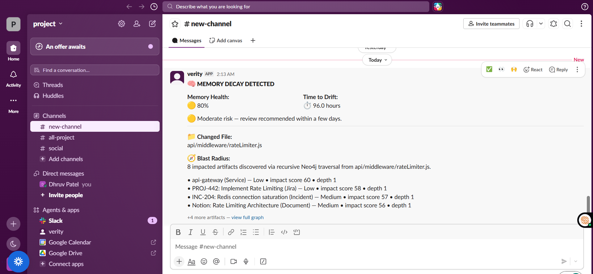
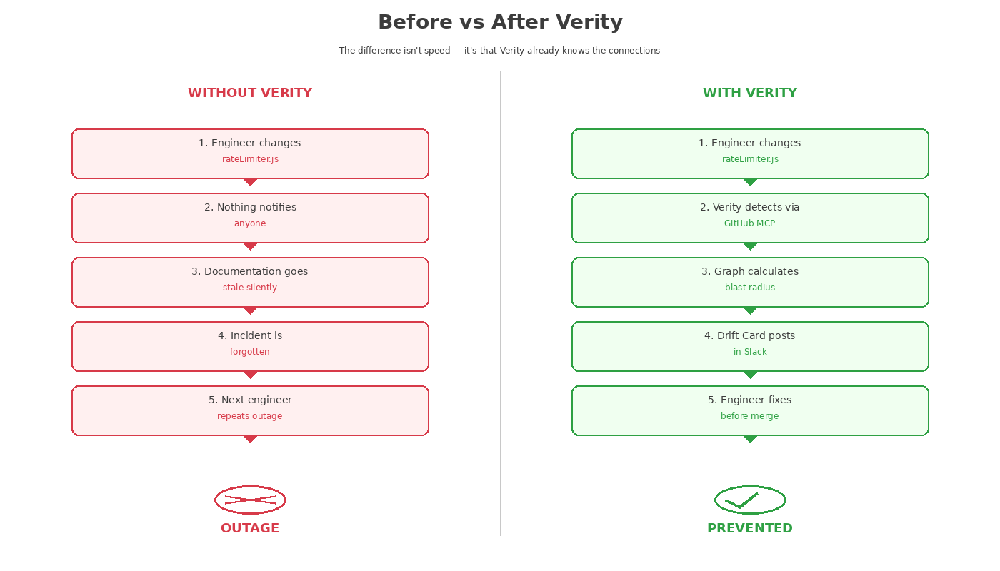
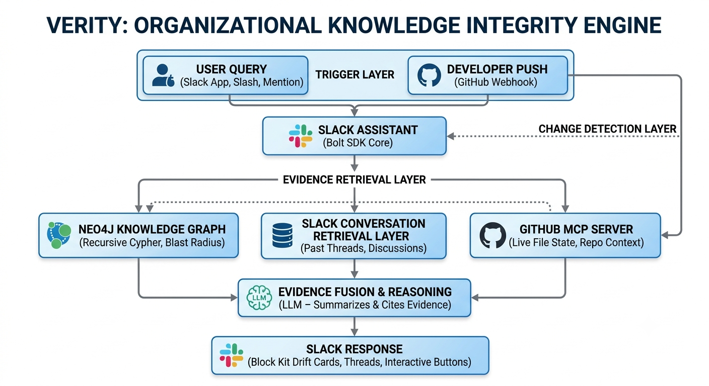
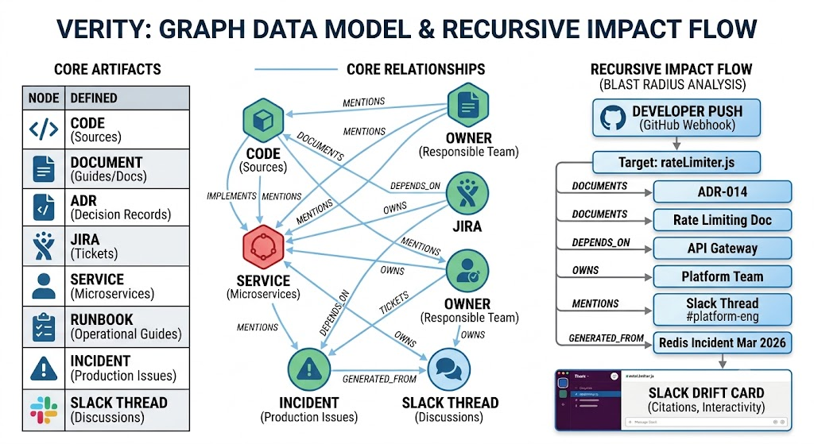
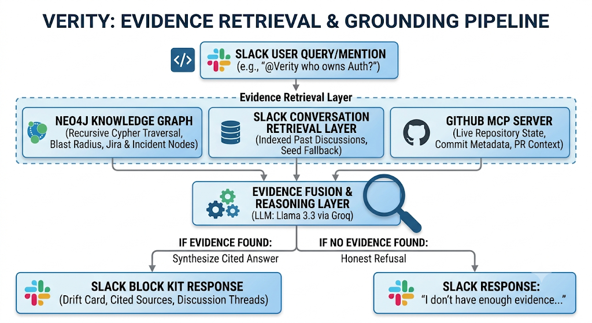
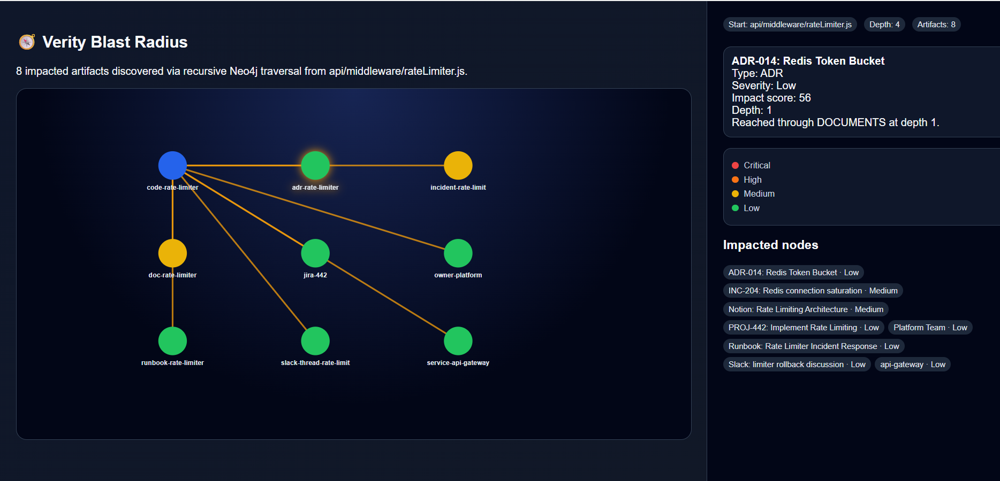
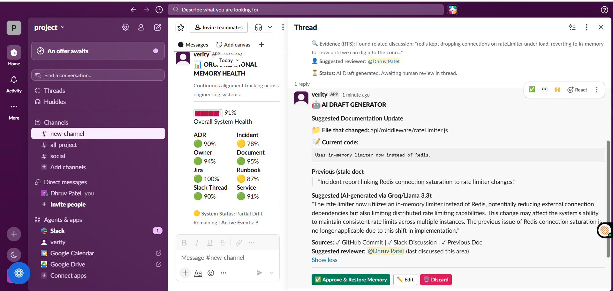
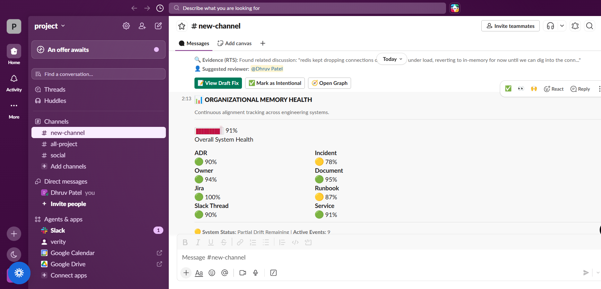
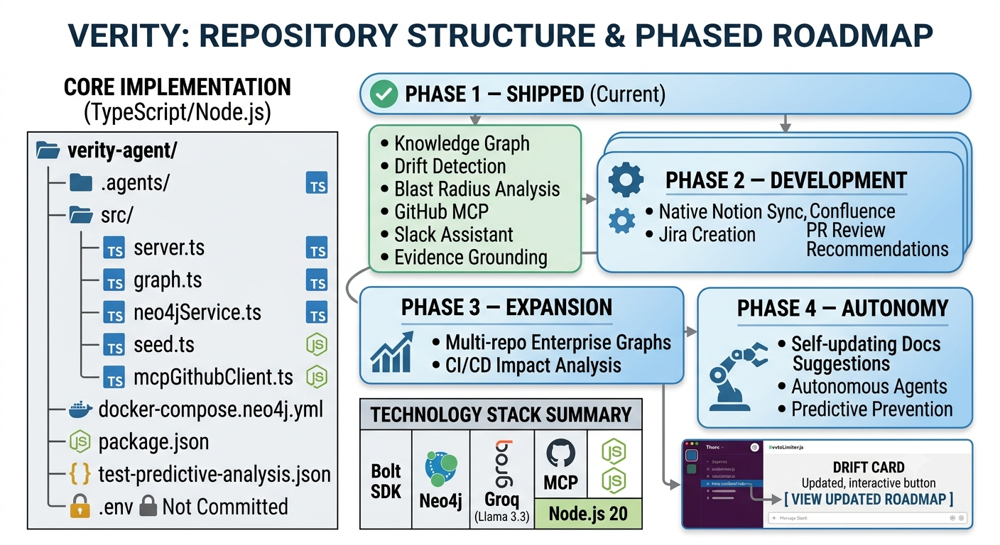

<p align="center">
  
  
  
  
  
  
  
</p>

<h1 align="center">Verity</h1>
<p align="center"><strong>Organizational Knowledge Integrity Engine — a Slack assistant that catches knowledge drift before it becomes production risk.</strong></p>

<p align="center">
  <em>Built for the Slack Agent Builder Challenge 2026</em>
</p>

---

## 🎬 Watch the 3-Minute Demo

<p align="center">
  <a href="https://youtu.be/BrIK7sZiI7M">
    
  </a>
</p>

<p align="center"><a href="https://youtu.be/BrIK7sZiI7M"><strong>▶ Watch the full demo video</strong></a></p>

> Prefer it playable directly on GitHub instead of linking out? Drag `Verity_Final_Demo.mp4` into a new GitHub Issue's comment box on your repo (no need to submit the issue), copy the `https://github.com/user-attachments/assets/...` URL it generates, and paste that URL alone on its own line anywhere in this file — GitHub renders it as an inline playable video automatically.

---

## The Problem

Engineering teams move fast. Every pull request changes reality — but the knowledge that describes that reality doesn't move with it.

- Documentation goes stale.
- Runbooks stop matching the system they describe.
- Architecture Decision Records get forgotten.
- Incident postmortems fade into old Slack threads no one re-reads.
- Ownership shifts, but nothing tracks it.

Weeks later, a different engineer touches the same file and unknowingly repeats an outage that already happened once. Nothing in the toolchain connects the dots — GitHub doesn't know what Confluence says, Confluence doesn't know what Jira says, and Slack doesn't know any of it changed.

**That gap is knowledge drift, and it's invisible until it causes a production incident.**

---

## Before vs After Verity

<p align="center">
  
</p>

The difference isn't that Verity works faster than a human search — it's that Verity already knows the connections *before* anyone has to go looking for them.

---

## What Verity Does

Verity watches a repository, builds a live knowledge graph of everything connected to that code, and tells you — inside Slack — what's now out of date and who needs to know.

Every recommendation is explainable. Every answer is backed by retrieved evidence. Every impacted artifact can be traced through the knowledge graph.

When code changes, Verity:

1. **Listens inside Slack** — through the Events API, Slash Commands, App Mentions, and Block Kit interactions, so engineers never leave their existing workflow.
2. **Retrieves the real, current file state** via the GitHub MCP server (not a cached webhook payload).
3. **Updates a Neo4j knowledge graph** connecting that code to docs, ADRs, runbooks, incidents, Jira tickets, owners, and Slack discussions.
4. **Recursively traverses the graph** using Cypher to compute a blast radius — everything downstream that might now be wrong.
5. **Retrieves supporting evidence** for each affected artifact — pulling from the Neo4j graph and the **Slack Conversation Retrieval Layer** (our custom retrieval over past Slack discussions) — instead of guessing.
6. **Synthesizes a grounded answer** using an evidence-grounded reasoning layer (LLM) that only summarizes and cites the evidence already retrieved — it does not originate facts.
7. **Posts a Drift Card in Slack**, with citations, so the right team sees it before it becomes a repeated incident.

Trust is a design requirement, not a feature. Verity never invents owners, incidents, or documentation. If sufficient supporting evidence cannot be retrieved, it explicitly states that it does not know.

---

## Quick Start

### 1. Clone the repository
```bash
git clone https://github.com/yourusername/verity-agent.git
cd verity-agent
```

### 2. Install dependencies
```bash
npm install
```

### 3. Configure environment variables
Create a `.env` file in the project root (never commit this file):
```env
SLACK_BOT_TOKEN=
SLACK_SIGNING_SECRET=
SLACK_APP_TOKEN=
NEO4J_URI=
NEO4J_USER=
NEO4J_PASSWORD=
GITHUB_PERSONAL_ACCESS_TOKEN=
GROQ_API_KEY=
```

### 4. Start Neo4j
```bash
docker compose -f docker-compose.neo4j.yml up -d
```

### 5. Seed the demo graph
```bash
npx ts-node src/seed.ts
```

### 6. Run Verity
```bash
npm run dev
```

Your Slack workspace is now connected. Try `@Verity who owns authentication?` in any channel Verity has been invited to.

For exact scoring formulas, relationship types, and API contracts, see [`docs/ARCHITECTURE.md`](docs/ARCHITECTURE.md).

---

## Architecture

Verity's stack is Slack-native at the front and back, with a graph-backed evidence layer in the middle. The reasoning model is one step in the pipeline — not the foundation it's built on.

<p align="center">
  
</p>

### Why GitHub MCP?

A traditional webhook only tells you *that* something changed — it doesn't reliably tell you the current, full state of the file, related commits, or pull request context, and payloads can be stale or incomplete by the time they're processed.

MCP gives Verity a standardized interface to request the actual current repository state — file contents, commit metadata, and pull request context — on demand, whenever it's reasoning about a change. That's why Verity re-fetches through MCP instead of trusting the webhook payload alone.

### How a code change flows through the system

```text
Developer pushes code
        │
        ▼
GitHub Webhook fires
        │
        ▼
GitHub MCP retrieves the current file
        │
        ▼
Neo4j graph updates relationships
        │
        ▼
Recursive blast-radius traversal runs
        │
        ▼
Evidence collected — Neo4j graph + Slack Conversation Retrieval Layer (seed fallback in demo mode)
        │
        ▼
Evidence-Grounded Reasoning Layer (LLM) summarizes evidence with citations
        │
        ▼
Slack Block Kit Drift Card is posted
        │
        ▼
Engineer reviews and acts before deployment
```

---

## The Knowledge Graph

Every organizational artifact is a node. Relationships connect them the way engineering knowledge actually connects in the real world — not the way it's siloed across five different tools.

<p align="center">
  
</p>

**Relationship types:** `DOCUMENTS`, `IMPLEMENTS`, `DEPENDS_ON`, `OWNS`, `GENERATED_FROM`, `MENTIONS`

Because Neo4j supports recursive Cypher traversal natively, Verity doesn't stop at direct relationships — it walks the full dependency chain to compute impact, the same way an experienced engineer would trace consequences by hand, just automatically and at graph scale.

---

## Why Graph + Retrieval Instead of Pure RAG?

A common question from technical reviewers: why build a knowledge graph instead of just embedding documents and doing vector search?

**Traditional RAG**
```text
Question
   │
   ▼
Vector similarity search
   │
   ▼
Relevant documents returned
```
This finds documents that are *semantically similar* to the question. It has no concept of *how those documents depend on each other*, who owns them, or what happened the last time something like this broke.

**Verity's approach**
```text
Question
   │
   ▼
Knowledge Graph traversal (Cypher)
   │
   ▼
Dependency chain discovered
   │
   ▼
Evidence retrieval across that chain
```
Because the graph models real relationships (`DEPENDS_ON`, `OWNS`, `GENERATED_FROM`, `MENTIONS`), Verity can answer questions that similarity search structurally cannot: what else breaks if this changes, who is responsible, and what already happened here before. Retrieval still happens — over Slack conversations and graph-linked evidence — but it's anchored to explicit relationships instead of similarity scores alone.

This isn't a rejection of retrieval — Verity still retrieves and cites evidence. It's a rejection of *similarity as the only signal*, in favor of relationships that actually reflect how engineering knowledge is connected.

---

## Evidence Retrieval Pipeline

Every answer Verity gives follows the same disciplined pipeline — no shortcuts, no guessing:

<p align="center">
  
</p>

If the pipeline can't find supporting evidence, Verity says so directly:

> "I don't have enough evidence to answer that."

instead of inventing an owner, a runbook, or an incident that doesn't exist. The reasoning layer's job is strictly to summarize and cite what the graph and the Slack Conversation Retrieval Layer have already retrieved — never to originate facts on its own. This is a deliberate design choice: a wrong confident answer about who owns what is worse than no answer at all.

---

## Slack-Native Experience

Verity lives entirely inside Slack — no separate dashboard to check.

**App mention**
```
@Verity who owns the authentication service?
```

**Slash command**
```
/verity explain the billing retry strategy
```

**Status lookup**
```
/verity-status api/middleware/auth.js
```

**Automatic Drift Cards**, posted whenever a change creates knowledge drift — this is a real screenshot from a live run, not a mockup:

<p align="center">
  
</p>

Every card includes interactive buttons to open the graph, review the underlying evidence, view the full blast radius, or ask a follow-up question — all without leaving the channel.

---

## Demo Walkthrough (3 minutes)

**Scenario:** an engineer modifies the Redis-backed rate limiter.

1. A GitHub webhook tells Verity that `api/middleware/rateLimiter.js` changed.
2. Verity pulls the current file contents via GitHub MCP — never a stale cache.
3. The knowledge graph identifies everything connected: ADR-014, the rate-limiting doc, the Platform Team, the API Gateway, a prior Redis incident, and the relevant Slack thread.
4. Recursive blast-radius analysis scores each connected artifact by dependency depth and relevance:

<p align="center">
  
</p>

5. A Drift Card posts automatically in Slack, showing the changed file, impacted docs, responsible team, related runbooks, and prior incidents.
6. An engineer asks `@Verity explain the impact of the rate limiter change` — Verity searches the graph, Slack, and GitHub, then responds with a cited, evidence-backed explanation.
7. The team can approve, edit, or discard an AI-drafted documentation fix — every draft is built strictly from cited sources, and a human always reviews before anything is restored:

<p align="center">
  
</p>

The drift never reaches production.

---

## Enterprise Use Cases

- **Documentation drift detection** — catches docs, ADRs, and runbooks that silently fall out of sync with the code they describe.
- **Blast radius analysis** — traces every downstream artifact affected by a change (docs, incidents, tickets, owners), not just the modified file.
- **Organizational memory** — connects knowledge scattered across GitHub, Slack, and Jira into one graph, so it survives employee turnover.
- **Engineering assistant** — answers questions like "who owns this service" or "why was Redis introduced here" with cited evidence instead of keyword search.
- **Incident investigation** — surfaces prior incidents, relevant runbooks, and responsible owners immediately, cutting investigation time during a live incident.
- **Onboarding** — lets new engineers ask natural-language questions in Slack and get answers grounded in real internal history, instead of spending weeks reverse-engineering tribal knowledge.

Verity also rolls drift up into an org-wide health score, so teams can see decay accumulating across the whole system, not just one file:

<p align="center">
  
</p>

---

## Technology Stack — What We Actually Built

Verity is built around four core integrations required by the challenge — a Slack app (Bolt SDK), GitHub MCP, the Slack Conversation Retrieval Layer, and a Neo4j knowledge graph. An LLM sits at the end of the pipeline purely as a reasoning/summarization step over evidence those four systems retrieve.

For exact scoring formulas, relationship types, API endpoints, and Slack action contracts, see [`docs/ARCHITECTURE.md`](docs/ARCHITECTURE.md).

| Layer               | Technology                             | Purpose                                                                    |
| ------------------- | ---------------------------------------- | --------------------------------------------------------------------------- |
| Language            | TypeScript                                | Core application language                                                  |
| Runtime             | Node.js 20                                | Application runtime                                                        |
| Backend             | Express.js                                | HTTP API and Slack endpoints                                               |
| Slack Integration   | Slack Assistant (Bolt SDK)                | Events API, Slash Commands, Block Kit, threaded replies                    |
| Enterprise Search   | Slack Conversation Retrieval Layer         | Custom retrieval over indexed Slack conversation data — not Slack's official Search/RTS API |
| Repository Access   | GitHub MCP Server                          | Live repository retrieval, commit metadata, pull request context          |
| Knowledge Graph     | Neo4j                                      | Cypher queries, recursive graph traversal, blast-radius scoring            |
| Evidence Pipeline   | Custom Retrieval Engine                    | Combines Neo4j + Slack Conversation Retrieval Layer results, with a seed-data fallback in demo mode |
| Evidence Reasoning  | Groq (Llama 3.3)                           | Grounded answer synthesis and summarization only — cites retrieved evidence, does not originate facts |
| Messaging UI        | Slack Block Kit                            | Interactive Drift Cards                                                   |
| Database            | Neo4j Aura / local Neo4j                   | Graph storage and persistence                                             |
| Event Source        | GitHub Webhooks                            | Detects engineering changes                                               |
| Deployment          | Docker                                     | Local and containerized deployment                                        |

**A note on accuracy:** Verity does not use Slack's built-in AI features (Slack AI Assistants / Agent Builder AI), and the Slack Conversation Retrieval Layer is a custom retrieval component we built — not Slack's official Real-Time Search API. Its Slack integration is built on the Bolt SDK, and its grounded reasoning step runs on the Groq API (Llama 3.3). That reasoning layer only summarizes and cites evidence already retrieved by Neo4j, the Slack Conversation Retrieval Layer, and GitHub MCP — it is not the system's core technology, and it does not run without that evidence. We'd rather state that precisely than have a judge ask us to demo a capability we didn't build.

---

## Judges' Corner

**Core technologies:** GitHub MCP Server, Neo4j Knowledge Graph, Slack App (Bolt SDK), and the Slack Conversation Retrieval Layer — combined into one evidence-grounded pipeline, with an LLM performing the final reasoning and summarization step.

**Technological Implementation**
- Slack Assistant (Bolt SDK) — Events API, Slash Commands, Block Kit, threaded conversations
- Neo4j enterprise knowledge graph modeling code, docs, ADRs, incidents, owners, and Slack threads as connected entities, with recursive Cypher traversal for blast-radius analysis
- Slack Conversation Retrieval Layer for retrieving relevant past Slack discussions as evidence (a custom retrieval component, not Slack's official Search API)
- GitHub MCP Server for live repository retrieval, commit metadata, and pull request context — no stale webhook payloads
- Custom evidence retrieval layer combining Neo4j + Slack Conversation Retrieval Layer results, with a seed fallback for demo reliability
- Evidence-Grounded Reasoning Layer (LLM) that summarizes and cites the evidence retrieved above — explicit "no evidence found" fallback instead of hallucinated answers

**Design**
- Fully native to Slack — zero context switching, no separate dashboard
- Evidence-first responses with visible citations
- Human-readable Drift Cards instead of raw graph dumps

**Potential Impact**
- Targets a real, underserved problem: documentation and knowledge decay outpacing code velocity
- Reduces incident investigation time by surfacing prior incidents and runbooks automatically
- Preserves institutional knowledge that would otherwise be lost to employee turnover or forgotten Slack threads

**Innovation**
- Applies graph-native, recursive reasoning to organizational knowledge instead of treating docs, code, and conversations as isolated silos
- Evidence grounding is a first-class design constraint, not an afterthought
- Chooses graph traversal over similarity-only retrieval so answers reflect real dependency, ownership, and history — not just semantic closeness

---

## Design Principles

- **Graph first.** Relationships between artifacts are treated as first-class data, not metadata.
- **Explainable.** Every answer shows its evidence and its reasoning path.
- **Human-in-the-loop.** Verity recommends; engineers decide.
- **No hallucinations.** Missing evidence is reported honestly, every time.
- **Slack native.** No new tool for engineers to learn or check.

---

## Roadmap

<p align="center">
  
</p>

- **Phase 1 — Shipped**
  - Knowledge graph
  - Drift detection
  - Blast radius analysis
  - GitHub MCP integration
  - Slack conversational assistant
  - Evidence grounding
  - Interactive Slack cards

- **Phase 2**
  - Native Notion sync
  - Automatic Jira issue creation
  - Confluence integration
  - PR review recommendations

- **Phase 3**
  - Multi-repository enterprise graphs
  - Cross-team dependency intelligence
  - CI/CD deployment impact analysis
  - Historical engineering analytics

- **Phase 4**
  - Self-updating documentation suggestions
  - Autonomous engineering agents
  - Predictive incident prevention

---

## Repository Structure

```text
verity-agent/
├── .agents/
├── docs/
│   ├── ARCHITECTURE.md
│   └── screenshots/
├── src/
│   ├── server.ts
│   ├── graph.ts
│   ├── neo4jService.ts
│   ├── seed.ts
│   └── mcpGithubClient.ts
├── docker-compose.neo4j.yml
├── package.json
├── package-lock.json
├── tsconfig.json
├── test-predictive-analysis.json
├── .env                  # local only — never commit this file
└── README.md
```

---

## Acknowledgements

Built for the **Slack Agent Builder Challenge 2026** to demonstrate how graph-native engineering intelligence can prevent organizational knowledge drift before it reaches production.

Thanks to the Slack Developer Platform team for the Bolt SDK, Events API, Slash Commands, and Block Kit — and to the maintainers of the GitHub MCP server, one of the core technologies this project is built around.

## License

This project is licensed under the MIT License — see [LICENSE](LICENSE) for details.

---

<p align="center"><strong>Built for the Slack Agent Builder Challenge 2026</strong></p>