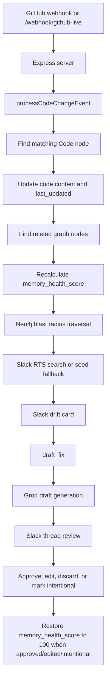

# Verity Architecture

This document describes the implementation in `src/server.ts`, `src/neo4jService.ts`, `src/graph.ts`, and `src/mcpGithubClient.ts`.

## System Overview



Main files:

- `src/server.ts`: Express app, Slack webhooks, drift processing, predictive analysis, Groq prompts, and Slack actions.
- `src/neo4jService.ts`: Neo4j connection, schema setup, node persistence, relationship creation, blast-radius query, severity helper.
- `src/graph.ts`: Seed graph and compatibility cache around Neo4j.
- `src/mcpGithubClient.ts`: GitHub MCP client and GitHub REST fallbacks.

## Knowledge Graph Model

Neo4j stores all nodes with the `Entity` label and these properties when seeded:

- `id`
- `type`
- `name`
- `content`
- `last_updated`
- `memory_health_score`
- `relationships`

The seeded node types are:

| Type | Examples in seed data |
| --- | --- |
| `Code` | `api/middleware/rateLimiter.js`, `api/middleware/auth.js`, `api/services/billing.js` |
| `Document` | Notion architecture/flow pages |
| `ADR` | `ADR-014: Redis Token Bucket` |
| `Jira` | `PROJ-442`, `PROJ-501`, `PROJ-317` |
| `Runbook` | incident response runbooks |
| `Service` | `api-gateway`, `identity-service`, `billing-service` |
| `Owner` | Platform, Identity, Payments teams |
| `Slack Thread` | seeded Slack decision threads |
| `Incident` | incident records such as `INC-204` |

`analyzeBlastRadius` also allows `PR` as a traversed target type, although no `PR` node is seeded by default.

Relationship types accepted by `Neo4jService` are:

- `IMPLEMENTS`
- `DOCUMENTS`
- `RELATED_TO`
- `DEPENDS_ON`
- `GENERATED_FROM`
- `OWNS`
- `MENTIONS`
- `PART_OF`
- `REVIEWED_BY`

Unknown relationship names are normalized to `RELATED_TO`. Blast radius uses Neo4j `shortestPath` over these relationship types up to a clamped depth from 1 to 8, with the server calling depth `4`.

## Severity And Health Scoring

Post-change drift health is calculated in `processCodeChangeEvent`:

```text
timeToDriftHours = codeUpdateTime - node.last_updated
daysDrift = timeToDriftHours / 24
memory_health_score = max(0, round(100 - daysDrift * 5))
```

Only related nodes whose `last_updated` is older than the code update are changed.

Blast-radius severity is calculated by `classifyHealthSeverity(health)`:

| Health score | Severity |
| --- | --- |
| `< 60` | `Critical` |
| `60-79` | `High` |
| `80-89` | `Medium` |
| `90-100` | `Low` |

Blast radius also computes an `impactScore`, but that is separate from health:

```text
impactScore = clamp(round(45 + max(0, depth - 1) * 12 + relationshipWeight * 10), 10, 99)
```

Relationship weights include `DEPENDS_ON: 1.5`, `IMPLEMENTS: 1.3`, `GENERATED_FROM: 1.2`, `DOCUMENTS: 1.1`, `OWNS: 1.0`, `REVIEWED_BY: 0.9`, `MENTIONS: 0.8`, and `RELATED_TO: 0.8`.

Predictive PR analysis does not mutate stored health. It calculates predicted health as:

```text
riskPenalty = round((confidence / 100) * 18)
agePenalty = round(min(25, ageHours / 24 * 4))
predictedHealth = clamp(currentHealth - riskPenalty - agePenalty, 0, 100)
```

## MCP Integration Detail

`src/mcpGithubClient.ts` starts the official GitHub MCP server with:

```text
npx -y @modelcontextprotocol/server-github
```

It passes `GITHUB_PERSONAL_ACCESS_TOKEN` to that server.

Implemented MCP calls:

- `get_file_contents`: used by `fetchFileContentViaMCP(owner, repo, path)` to read live file content. JSON/base64 content is decoded when needed.
- `list_commits`: used by `fetchLatestCommitContextViaMCP` and `fetchRecentRepoActivityViaMCP`.
- `get_pull_request`: used to fetch a PR body when a path-specific latest commit can be associated with a PR.

GitHub REST fallbacks are also used:

- `/repos/{owner}/{repo}/commits?path={path}&per_page=1` finds the latest commit for a specific path because the MCP `list_commits` call is repo-wide in this implementation.
- `/repos/{owner}/{repo}/commits/{sha}/pulls` maps a commit SHA to a pull request.
- `/repos/{owner}/{repo}/pulls?state=all...` fetches recent PR activity for conversational evidence.
- `/repos/{owner}/{repo}/pulls/{pullNumber}/files` fetches changed files if a PR webhook payload does not include file details.

## Conversational Agent Evidence Pipeline

Slack app mentions and `/verity` use the same answer path:

1. `normalizeQuestionText` removes bot mentions and normalizes whitespace.
2. `getQuestionTerms` extracts unique keyword-like terms and removes stopwords.
3. `scoreGraphNode` scores local graph nodes by term matches and question intent:
   - owner questions boost `Owner`
   - health/unhealthy questions boost nodes below 90 health
   - runbook, incident, architecture, and drift terms boost matching node types
4. `collectConversationalEvidence` converts top graph nodes to `[G...]` evidence and expands related nodes for `Code` and `Service` matches.
5. `searchSlackEvidence` adds Slack `search.messages` results as `[S...]` evidence, with seed fallback when `RTS_DEV_MODE` is enabled.
6. `getGithubActivityEvidence` adds recent commits and PRs as `[H...]` evidence when the question asks about changes, PRs, architecture, drift, or health.
7. `generateConversationalAnswer` sends the evidence block to Groq with instructions to cite every factual claim or say the evidence is insufficient.
8. If Groq is unavailable or there are no sources, `fallbackConversationalAnswer` returns a bounded answer from the collected evidence.

## Slack Interaction Contract

| `action_id` or callback | Where it appears | Server behavior |
| --- | --- | --- |
| `draft_fix` | Drift card and restored root actions | Calls `handleDraftFix`, posts an AI draft in a Slack thread, stores the draft, and marks the original card as awaiting review. |
| `mark_intentional` | Drift card and restored root actions | Calls `handleMarkIntentional`, sets `memory_health_score` to `100`, updates `last_updated`, marks `intentional: true`, and replaces original Slack blocks. |
| `open_graph` | Drift card button with URL | Link-only action. Server logs the click; the button URL opens `/graph/blast-radius/:nodeId`. |
| `verity_approve` | Draft review thread | Calls `handleApprove`, restores sibling artifacts for the code node to `memory_health_score: 100`, updates Slack, and posts a fresh dashboard. |
| `verity_edit` | Draft review thread | Calls `handleEditOpen`, opening a Slack modal prefilled with the draft or artifact content. |
| `verity_discard` | Draft review thread | Calls `handleDiscard`, deletes the stored draft and restores root card actions where possible. |
| `edit_draft_modal` | Slack modal `callback_id` | Handled as `view_submission`; saves edited text to the artifact, restores health to `100`, updates Slack, and posts a fresh dashboard. |

The edit modal uses block ID `edit_block` and input action ID `edit_input`.

## API Endpoints Reference

| Method | Path | Purpose | Auth/signature behavior |
| --- | --- | --- | --- |
| `GET` | `/graph/blast-radius/:nodeId` | Runs `analyzeBlastRadius` and returns an interactive HTML graph. | No signature middleware. |
| `POST` | `/webhook/github` | If the event is PR opened, runs predictive drift and posts to Slack. Otherwise processes a code-change event from `file` and `new_content`, with demo defaults. | Uses `verifyGitHubWebhook`; skipped with warning if `GITHUB_WEBHOOK_SECRET` is unset. |
| `POST` | `/webhook/github-live` | Fetches live file content and commit context through GitHub MCP/REST, then processes a code-change event. | Uses `verifyGitHubWebhook`; skipped with warning if `GITHUB_WEBHOOK_SECRET` is unset. |
| `GET` | `/test-predictive` | Temporary local debug endpoint for predictive analysis; does not mutate webhook behavior. | No signature middleware. |
| `POST` | `/slack/events` | Handles Slack URL verification and app mentions. | Uses Slack signature verification; skipped with warning if `SLACK_SIGNING_SECRET` is unset. |
| `POST` | `/slack/commands` | Handles `/verity` conversational questions and `/verity-status`-style lookups for other command names. | Uses Slack signature verification; skipped with warning if `SLACK_SIGNING_SECRET` is unset. |
| `POST` | `/slack/actions` | Handles Slack buttons and modal submissions. | Uses Slack signature verification; skipped with warning if `SLACK_SIGNING_SECRET` is unset. |

Raw-body JSON middleware is attached to `/webhook/github` and `/webhook/github-live` so GitHub HMAC verification can use exact request bytes. A terminal Express error middleware returns `400 Bad Request` for rejected signed requests.

## Environment Variables Reference

| Name | Required/optional | Description | Example |
| --- | --- | --- | --- |
| `SLACK_BOT_TOKEN` | Required for Slack posting/actions | Bot token for posting drift cards, dashboards, threads, modal updates, and conversation calls. | `xoxb-...` |
| `SLACK_USER_TOKEN` | Required for live RTS | User token used for `slackUser.search.messages`. | `xoxp-...` |
| `SLACK_SIGNING_SECRET` | Recommended | Verifies Slack event, slash command, and action signatures. If missing, verification is skipped. | `8f742231b...` |
| `SLACK_DRIFT_CHANNEL` | Optional | Destination channel for drift cards. Defaults to `engineering-alerts`. | `engineering-alerts` |
| `GROQ_API_KEY` | Required for AI generation | Enables Groq/Llama 3.3 drafts, predictive suggestions, and conversational answers. | `gsk_...` |
| `GITHUB_PERSONAL_ACCESS_TOKEN` | Required for GitHub MCP/REST | Starts GitHub MCP server and authenticates GitHub REST calls. | `ghp_...` |
| `GITHUB_OWNER` | Optional default | Default GitHub owner when request bodies omit `owner`. | `acme` |
| `GITHUB_REPO` | Optional default | Default GitHub repo when request bodies omit `repo`. | `platform-api` |
| `GITHUB_WEBHOOK_SECRET` | Recommended | Verifies GitHub webhook signatures. If missing, verification is skipped. | `local-secret` |
| `PUBLIC_BASE_URL` | Optional | Public URL used for Slack blast-radius links. Defaults to local `PORT`. | `https://example.ngrok.app` |
| `PORT` | Optional | Express listen port. Defaults to `3000`. | `3000` |
| `RTS_DEV_MODE` | Optional | Seed fallback mode for Slack RTS. Any value except `false` enables it. | `true` |
| `SEED_REVIEWER_PRIYA_ID` | Optional | Slack user ID for rate-limiter fallback reviewer. | `U012ABC3DE` |
| `SEED_REVIEWER_MARCUS_ID` | Optional | Slack user ID for auth fallback reviewer. | `U045ABC6FG` |
| `SEED_REVIEWER_DANA_ID` | Optional | Slack user ID for billing fallback reviewer. | `U078ABC9HI` |
| `NEO4J_URI` | Optional with local default | Neo4j Bolt URI. Defaults to `bolt://localhost:7687`. | `bolt://localhost:7687` |
| `NEO4J_USER` | Optional with local default | Neo4j username. Defaults to `neo4j`. | `neo4j` |
| `NEO4J_PASSWORD` | Optional with local default | Neo4j password. Defaults to `password`. | `password` |

## Known Implementation Tradeoffs

- Slack search may fail on workspaces/plans where `search.messages` is unavailable; the code logs this and uses seed fallback data when allowed.
- Missing Slack or GitHub signing secrets intentionally skip verification for local development, but the log calls this unsafe for production.
- The Groq draft prompt explicitly avoids invented causal stories when commit/PR context is unavailable.
- The graph cache keeps the previous array-shaped API while syncing seeded and updated data into Neo4j.
- Duplicate event detection is an in-memory set, so it is process-local.
